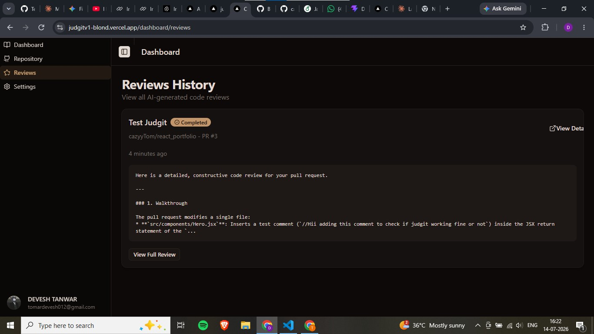
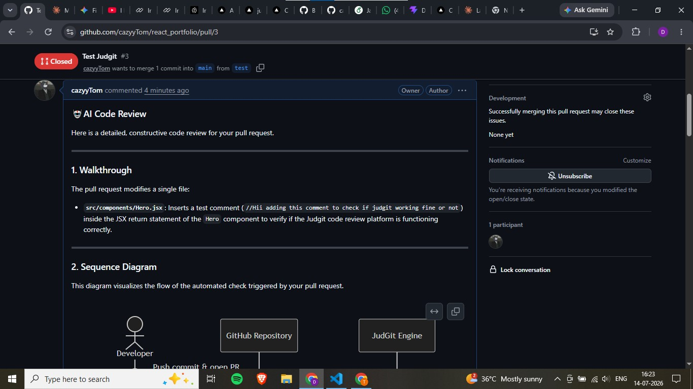
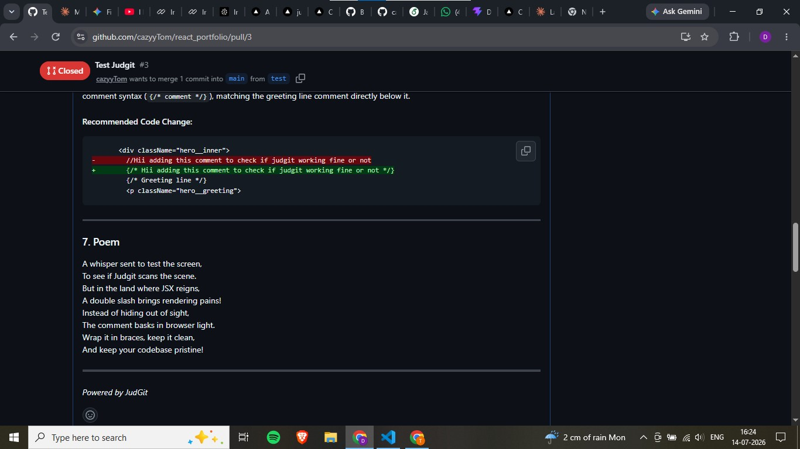

# JudGit 🤖

**AI-powered code review for your GitHub pull requests.**

JudGit connects to your GitHub repositories and automatically reviews every pull request using an LLM (Google Gemini), grounded with context retrieved from your own codebase via a vector database (RAG). Reviews are posted directly as PR comments and logged in a dashboard you can revisit anytime.

---

## ✨ Features

- **GitHub OAuth login** — sign in with your GitHub account (via [better-auth](https://www.better-auth.com/)).
- **One-click repo connection** — browse your repositories and connect the ones you want reviewed; JudGit auto-registers a GitHub webhook (`pull_request` events) on connect.
- **Automatic codebase indexing (RAG)** — when a repo is connected, its files are fetched, embedded (Gemini embeddings), and stored in Pinecone so reviews can reference real project context, not just the diff.
- **AI-generated PR reviews** — on every PR open/sync, JudGit:
  - fetches the PR diff, title, and description,
  - retrieves relevant codebase context from Pinecone,
  - asks Gemini for a structured review (walkthrough, Mermaid sequence diagram, summary, strengths, issues, suggestions, and a closing poem),
  - posts the review as a comment on the PR,
  - saves the result to the database.
- **Dashboard** — contribution graph, total commits/PRs/reviews/repos, and a 6-month activity chart, all pulled live from GitHub.
- **Review history** — a searchable log of every review JudGit has generated, with status (`completed` / `failed`) and a link back to the PR.
- **Background processing with Inngest** — webhook handling is decoupled from the (slower) indexing and review-generation work via event-driven background functions, so GitHub webhooks return instantly.

## 🧱 Tech Stack

| Layer            | Choice                                                        |
|------------------|----------------------------------------------------------------|
| Framework        | Next.js (App Router) + TypeScript                              |
| UI               | Tailwind CSS + shadcn/ui component library                     |
| Auth             | better-auth (GitHub OAuth provider)                             |
| Database         | PostgreSQL via Prisma ORM (`@prisma/adapter-pg`)                |
| Background jobs  | [Inngest](https://www.inngest.com/) (event-driven functions)   |
| Vector store     | Pinecone (RAG context for codebase-aware reviews)               |
| AI / LLM         | Google Gemini via the Vercel AI SDK (`ai`, `@ai-sdk/google`)     |
| GitHub API       | Octokit                                                          |
| Deployment       | Vercel                                                           |

## 🏗️ How It Works

```
Developer pushes commit / opens PR
            │
            ▼
   GitHub → POST /api/webhooks/github  (pull_request event)
            │
            ▼
   reviewPullRequest() fetches PR diff + fires "pr.review.requested" event
            │
            ▼
        Inngest function: generateReview
            │
   ┌────────┼─────────────────────────────┐
   ▼        ▼                             ▼
fetch PR   retrieve RAG context        generate AI review
data       (Pinecone, by repo)         (Gemini, via Vercel AI SDK)
   │                                       │
   └───────────────┬───────────────────────┘
                    ▼
       post review as GitHub PR comment
                    │
                    ▼
         save Review record in Postgres
```

Repository indexing runs the same way: connecting a repo fires a `repository.connected` event, which triggers the `indexRepo` Inngest function to pull the repo's files, embed them, and upsert them into Pinecone — so review context stays available for future PRs.

## 📁 Project Structure

```
app/
  (auth)/                 → sign-in routes
  api/
    auth/[...all]/        → better-auth handler
    webhooks/github/      → GitHub webhook receiver (pull_request events)
    inngest/               → Inngest serve endpoint
  dashboard/               → dashboard, repository, reviews & settings pages
module/
  ai/                      → RAG (Pinecone embeddings) + review-trigger action
  auth/                    → login UI, auth hooks & utils
  dashboard/               → stats/contribution-graph server actions
  github/                  → Octokit wrappers (repos, webhooks, diffs, comments)
  repository/              → connect/disconnect repository logic
  review/                  → fetch review history
  settings/                → profile + connected-repo management UI
inngest/
  client.ts                → Inngest client instance
  functions/
    review.ts              → generateReview (PR review pipeline)
    index.ts                → indexRepo (codebase embedding pipeline)
lib/
  auth.ts / db.ts / pinecone.ts → service clients (better-auth, Prisma, Pinecone)
components/ui/             → shadcn/ui component library
```

## ⚙️ Environment Variables

Based on the services wired up in the code, JudGit expects:

```
DATABASE_URL=                # Postgres connection string (Prisma)
GITHUB_CLIENT_ID=            # GitHub OAuth App client ID
GITHUB_CLIENT_SECRET=        # GitHub OAuth App client secret
NEXT_PUBLIC_APP_BASE_URL=    # Public base URL, used to register the webhook
PINECONE_DB_API_KEY=         # Pinecone API key (index: judgit-vector-embedding-v1)
GOOGLE_GENERATIVE_AI_API_KEY=# Google Gemini API key (Vercel AI SDK)
```

If deploying Inngest functions in production, you'll also need Inngest's `INNGEST_EVENT_KEY` / `INNGEST_SIGNING_KEY`.

## 🚀 Getting Started

```bash
# install dependencies
npm install

# generate the Prisma client & apply migrations
npx prisma generate
npx prisma migrate dev

# run the app locally
npm run dev
```

Then, on GitHub:
1. Create an OAuth App and add its client ID/secret to your `.env`.
2. Sign in to JudGit with GitHub.
3. Connect a repository from the **Repository** tab — JudGit registers a `pull_request` webhook automatically.
4. Open a pull request on that repo and watch JudGit review it.

## ✅ Tested

The end-to-end flow — webhook → background review generation → GitHub comment → dashboard logging — was verified against a real repository (`cazyyTom/react_portfolio`) using a throwaway PR (`Test Judgit #3`) that added a one-line test comment to `Hero.jsx`.

**1. Dashboard → Reviews History** shows the run completed a few minutes after the PR was opened, with a preview of the AI's walkthrough:



**2. The GitHub PR itself** received JudGit's automated comment, including the walkthrough of the changed file and a Mermaid sequence diagram of the Developer → GitHub → JudGit Engine flow:



**3. Further down the same comment**, JudGit suggested a concrete code fix (swapping a `//` comment for a JSX-safe `{/* */}` comment) and closed out with its signature poem, confirming the full response — including code suggestions and formatting — rendered correctly on GitHub:



This confirmed the webhook registration, Inngest pipeline, Gemini review generation, GitHub comment posting, and dashboard sync all work together correctly on a live PR.

## 🛠️ Known TODOs (found in code)

- Enforce a cap on how many repositories a user can connect (currently unlimited).
- No `package.json`/lockfile was included in this export — add project dependencies and scripts before running the install steps above.

## 📄 License

Add your license of choice here.
